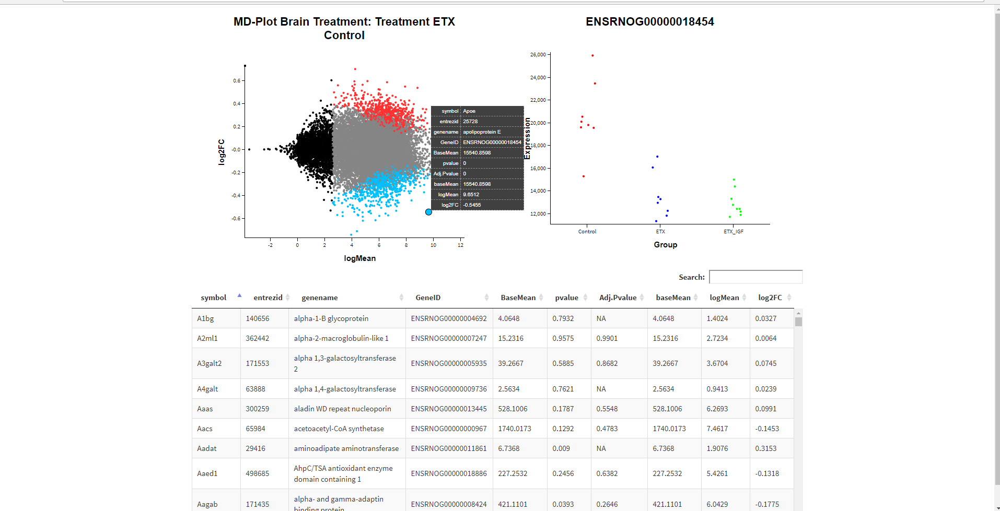
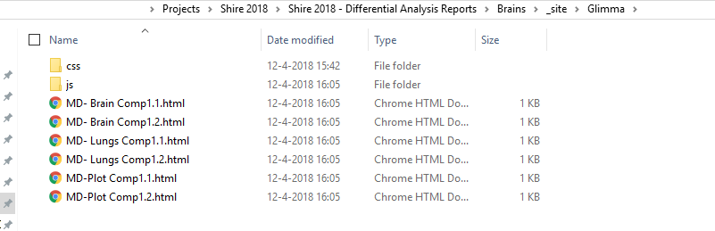

```{r setup, include=FALSE}
knitr::opts_chunk$set(echo = TRUE)
```


# About this page

This page contains differential gene expression analyses on rat tissues for the Shire 2018 project. The included tissues are,

  * Brain
  * Lungs
  * Eyes
  
All analysis output is grouped together in .HTML reports for presentation.
All the resulting data can also be found in the **OutputData** subfolder of this report.

Use the navigation bar at the top to view the results for different tissues.

# Plots of results

You can explore individual genes from the differential analysis results in an interactive plot. These plots can be found in multiple ways.


*Screenshot of interactive results plot*


## Links

We recommend opening these links in a new window or a new tab. 
To open the plots in a new tab, **hold Ctrl when you click the link**.

* [Brain comparison ETX vs Control](./Glimma/MD- Brain Comp1.1.html)
* [Brain comparison ETX+IGF vs ETX](./Glimma/MD- Brain Comp1.2.html)
* [Lungs comparison ETX vs Control](./Glimma/MD- Lungs Comp1.1.html)
* [Lungs comparison ETX+IGF vs ETX](./Glimma/MD- Lungs Comp1.2.html)
* [Eyes comparison ETX vs Control](./Glimma/MD- Eyes Comp1.1.html)
* [Eyes comparison ETX+IGF vs ETX](./Glimma/MD- Eyes Comp1.2.html)

## Subfolder

This .html files should be located in a folder that includes the subfolder **Glimma/**. This folder contains .html files that you can open in your browser to view the results.



## Within the report

You can open reports for any tissue using the navigation bar at the top. You'll find links to the interactive plots 

